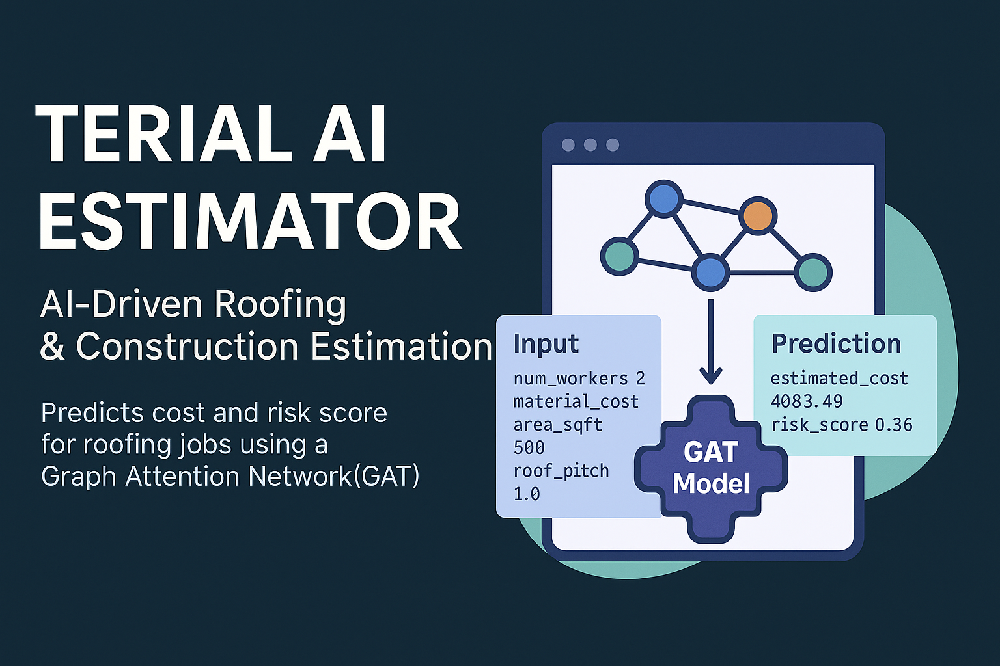

# 🧠 Terial AI Estimator



A Graph Attention Network (GAT)-powered AI prototype that predicts project **estimated cost** and **risk score** using real-world construction job data.

Built to demonstrate practical, scalable AI integration for platforms like [Terial](https://terial.com), this system features:

- 🔁 Trainable GAT model in PyTorch
- 📡 Real-time predictions via FastAPI
- 📈 Graph-based job relationship modeling
- 📦 Easily extensible architecture

---

## 🚀 Features

- **Trainable GAT Neural Network**: Learns from historical job relationships and project attributes
- **Live Prediction Endpoint**: Accepts new job input and returns predicted cost/risk
- **Structured Dataset Support**: With graph edges and feature normalization
- **FastAPI Interface**: Ready for API integration or frontend consumption

---

## 🗂️ Project Structure

```

terial_ai_gat/
├── data/
│   ├── dataset.json              # Full training dataset (nodes + edges)
│   └── real-time-predict.jsonl   # Known records used for prediction context
├── docs/
│   ├── train.md                  # Training guide
│   ├── predict.md                # Inference/prediction guide
│   └── dataset.md                # Dataset format and logic
├── models/
│   ├── gat_model.pt              # Trained model weights (generated after training)
├── api_server.py                 # FastAPI service for live prediction
├── config.py                     # Model hyperparameters and paths
├── model.py                      # GAT model architecture (PyTorch)
├── predict.py                    # CLI script for real-time prediction
├── train.py                      # Training pipeline
├── requirements.txt              # Python dependencies
└── README.md                     # ← You're here

````

---

## 🧪 Try It

### 1. 🔧 Setup Environment

```bash
python3 -m venv venv
source venv/bin/activate
pip install -r requirements.txt
````

---

### 2. 🎯 Train the Model

```bash
python train.py
```

* Model weights saved to `models/gat_model.pt`

---

### 3. 📊 Predict from CLI

```bash
python predict.py
```

Update the embedded JSON inside `predict.py` to test different inputs.

---

### 4. 🌐 Run the API Server

```bash
uvicorn api_server:app --reload
```

#### Sample Request:

```bash
curl -X POST http://localhost:8000/predict/ \
-H "Content-Type: application/json" \
-d '{
  "num_workers": 2,
  "material_cost": 800,
  "area_sqft": 500,
  "roof_pitch": 1.0
}'
```

#### Sample Response:

```json
{
  "estimated_cost": 4083.49,
  "risk_score": 0.36
}
```

---

## 🧠 Under the Hood

* **Graph-Based Learning**: Each job is treated as a node, connected to similar projects
* **GAT Model**: Learns importance of neighbors using attention scores
* **Flexible Adjacency**: Easily expand with new job relationships
* **Fully Extensible**: Integrate external data, deploy via Docker, or add evaluation tools

---

## 📌 Use Cases

* Roofing or construction estimate automation
* Lead scoring in contractor SaaS
* Bid optimization tools
* Embedded ML intelligence in project dashboards

---

## 🤝 Acknowledgments

This project was designed to showcase AI estimation potential as part of a **founder-level full stack engineer** role with **Terial**.
